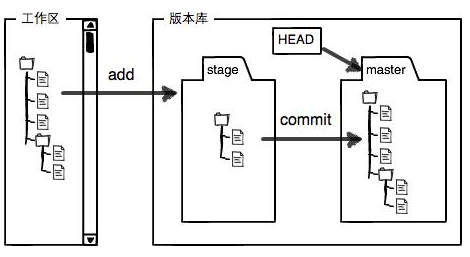

# GitStudy
My experience of restuding git command etc.


**Git诞生原因：**

1、Linus在1991年创建开源Linux，刚开始世界各地通过diff方式，发给Linus本人手工方式合并

2、但是随着规模扩大，很难手工管理。2002年，BitMover公司处于人道主义精神，授权Linux社区免费使用此版本管理系统

3、由于Linus社区有人试图破解BitKeeper的协议，被公司收回了免费使用权

4、Linux花了两周用c写了第一版的分布式版本控制系统，就是Git

5、2008年，Github网站上我，它为开源项目免费提供Git存储！


**集中式和分布式：**

区别：

1、网络敏感性

2、版本库安全性

3、分支支持模式


**创建版本库：**

```bash
mkdir learngit
cd learngit
git init
```

**文件添加到版本库：**

注：

1、所有版本控制系统，只能跟踪文本文件改动，二进制文件是没办法跟踪变化

2、建议不要用Windows的记事本编写文本

```bash
git add xxx.txt
git commit -m "wrote a readme file"
```


**查询仓库状态：**

```
git status
```


**查询当前工作目录某文件和版本库对比的修改内容：**

```
git diff [filename]
```


**查询提交记录：**

```
git log
git log --pretty=oneline

//默认显示从最近到最远的日志记录
git log
commit 7fb71cb4b3bad42dfca6760f1c726ec160de463a (HEAD -> main)
Author: hangdada <824362330@qq.com>
Date:   Fri Jul 12 17:55:03 2024 +0800

    Git add distributed

commit d2ce32f101ce47c7236e473d8027bca4ffa4cd7c
Author: hangdada <824362330@qq.com>
Date:   Fri Jul 12 17:52:08 2024 +0800

    add diff to readme.txt

//如果觉得信息太多，可加上 --pretty=oneline参数
git log --pretty=oneline
7fb71cb4b3bad42dfca6760f1c726ec160de463a (HEAD -> main) Git add distributed
d2ce32f101ce47c7236e473d8027bca4ffa4cd7c add diff to readme.txt
e1c65d87b6d27bff8729556b51e3bac1edfddd0f add readme file.txt
af7fb6de80b6e3a44e32bcca0092ab945d550e1c (origin/main, origin/HEAD) Initial commit
```


**版本回退：**

```
git reset --hard [commitid]  回退到指定版本
git reset --hard HEAD^ 回退到当前版本的上一个版本
```

回退之后，通过`git log` 就查不到回退之前的commitid了，但是如果真的后悔了，怎么办？

```
git reflog 它会输出你的每一次命令，就可以找到对应的记录，寻找到之前的commitid，就可以回退回去！
-----------------
7fb71cb (HEAD -> main) HEAD@{0}: reset: moving to HEAD^
e95f5c3 (origin/main, origin/HEAD) HEAD@{1}: reset: moving to e95f5c3f
7fb71cb (HEAD -> main) HEAD@{2}: reset: moving to HEAD^
e95f5c3 (origin/main, origin/HEAD) HEAD@{3}: reset: moving to HEAD
e95f5c3 (origin/main, origin/HEAD) HEAD@{4}: clone: from github.com:hangge1/GitStudy.git
最左侧，就是HEAD版本号的切换情况
```


理解工作区、暂存区、版本库的概念。

git add命令的本质就是将工作区的文件新增、修改、删除情况，反馈到暂存区；

git commit命令的本质就是将暂存区的记录提交到版本库；




理解Git跟踪修改，举个简单例子：

`第一次修改readme.txt`->`git add readme.txt`->`第二次修改readme.txt`->`git commit`

最终的就是就是将第一次修改保存到版本库上！


**针对工作区修改的撤销：**

两种情况：

1、修改某文件后，还没提交到暂存区

2、修改文件并已提交到暂存区后，又修改该文件


`git checkout -- [file]`

`git restore [file]`

针对1情况：恢复该文件到最新版本库一样

针对2情况：恢复到提交到暂存区的情况


**撤销暂存区的修改：**

`git reset HEAD [file]`


**从版本库删除文件：**

`git rm [file]`

如果手动删除某版本库存在的文件，正常提交git commit是通过不了的，必须先`git rm xxx`，再commit！


**多人协作：**

查看远程库名称：`git remote`

查看远程库详细信息：`git remote -v`

推送分支到远程：`git push [remote_resposoty_name] [local_branch_name]`

同步已绑定远程库分支的本地分支：`git pull`

指定本地分支和远程分支链接：

`git branch --set-upstream-to=[remote_rep_branch_name] [local_branch_name]`

例如：

`git branch --set-upstream-to=origin/dev dev`


**Rebase：**

有待进一步了解


**标签管理：**

发布一个版本时，我们通常先在版本库中打一个标签（tag），这样，就唯一确定了打标签时刻的版本，标签也是版本库的一个快照！

标签的本质：指向某个commit的指针（跟分支很像对不对？但是分支可以移动，标签不能移动）


已经有了commitid，为啥还需要tag呢？

答：他可以用更加有意义、可读、可理解的办事，标明改版本！


给当前分支添加标签：`git tag [tag_name]`

针对某个历史commit添加标签：`git tag [tag_name] [commit_id]`

查看所有标签：`git tag`

查看某标签详细信息：`git show [tag_name]`

创建带有说明的标签：`git tag -a [tag_name] -m "说明" [commit_id]`

删除标签：`git tag -d [tag_name]`

推送某标签到远程：`git push [remote_rep_name] [tag_name]`，如：`git push origin v1.0`

一次性推送全部尚未推送到远程的本地标签：`git push origin --tags`

删除远程仓库标签：

（1）本地删除标签：`git tag -d [tag_name]`

（2）删除远程标签：`git push origin :refs/tags/[tag_name]`


**参与Github开源项目：**

最简步骤：

1、fork目标项目

2、clone到自己本地

3、修复提交到自己分支

4、申请pull request


